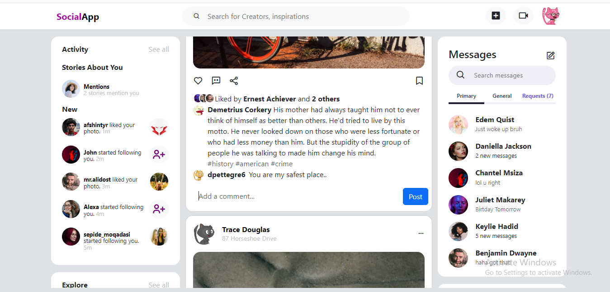
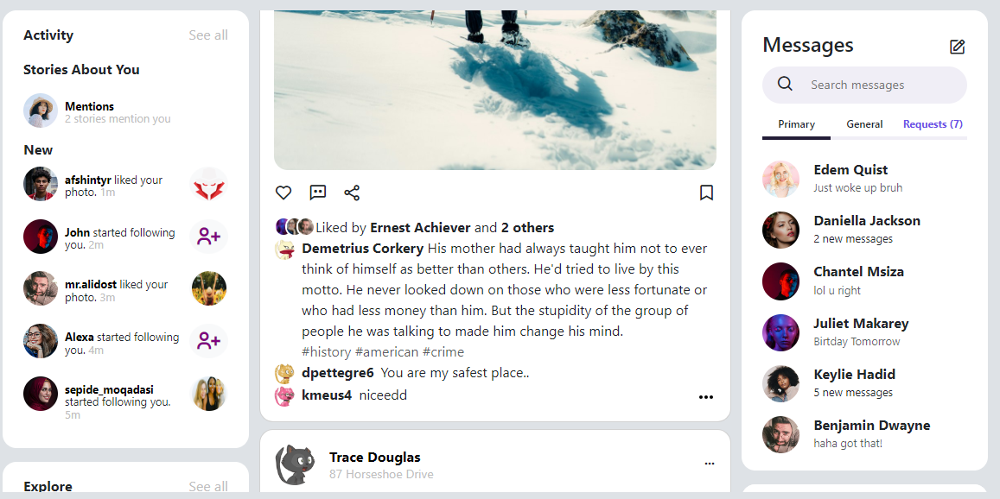
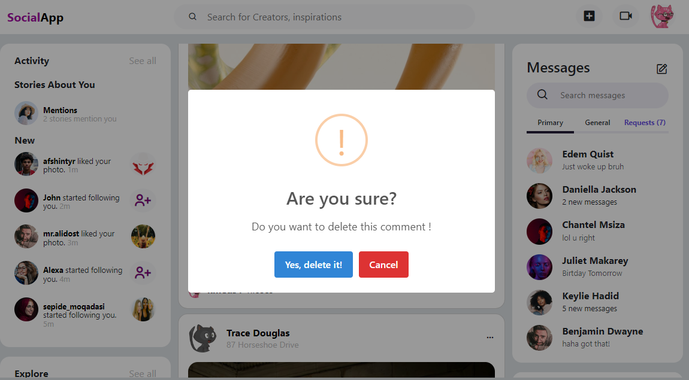

# Project Title: Social Media App

## Table of Contents

1. [Introduction](#introduction)
2. [Scope](#scope)
3. [Purpose](#purpose)
4. [Problem Statement](#problem-statement)
5. [Features](#features)
6. [Technical Aspects](#technical-aspects)
7. [Technology Stack](#technology-stack)
8. [Authorization Flow](#authorization-flow)
9. [Installation Guide](#installation-guide)
10. [User Manual](#user-manual)

## Introduction

This project aims to create a social media website using HTML, CSS, Bootstrap, and JavaScript. The website will utilize a Fake API to display user posts, users, and post comments. Users will be able to interact with the system by logging in, viewing posts, adding comments, deleting comments, editing comments, and logging out.

## Scope

The scope encompasses frontend development tasks, including the implementation of fundamental JavaScript concepts such as API requests, asynchronous operations, and client-side data storage via localStorage. Additionally, emphasis will be placed on crafting an intuitive user interface with robust form validation features.

## Purpose 

The primary objective is to cultivate proficiency in frontend design and JavaScript programming through the creation of a dynamic social media platform. By constructing this application, participants will deepen their understanding of HTML, CSS, Bootstrap, and JavaScript in the presence of class base Structure, while also refining their skills in user interface development and data management.

## Problem Statement

Developing a social media website with frontend functionalities poses challenges such as implementing user authentication, managing post data, handling comments, and ensuring smooth user interaction. This project addresses these challenges through careful design and implementation.

## Features:
1. User authentication
2. Displaying posts
3. Lazy loading for infinite scrolling
4. Post searching
5. Displaying comments with posts
6. Viewing posts by specific users
7. Comment deletion
8. Comment editing
9. Comment addition
10. Logout functionality
11. Form validations
12. Redirects or routing for unauthorized access
13. Session Expiration Alert : Notify users when their session is about to expire, redirecting them to the login page for uninterrupted access.

## Technical Aspects

- Implement frontend using HTML and Bootstrap and CSS for styling.
- Utilize JavaScript for dynamic interactions and API calls.
- Implement form validations to ensure data integrity and for smooth user interaction.
- Use localStorage to store user data such as tokens for authentication.
- Implement pagination for post display.
- Enable search functionality to find specific posts.
- Implement CRUD operations for comments (Create, Read, Update, Delete).
- Implement routing or redirects for proper navigation within the website.

## Technology Stack

- HTML
- CSS
- Bootstrap
- JavaScript
- Mock API's

## Authorization Flow

1. User logs in using credentials.
2. Upon successful login, user data including token is stored in localStorage.
3. User interacts with the website, performing various actions such as viewing posts, adding comments, etc.
4. User logs out, clearing localStorage and ending the session.

## Installation Guide:
1. Clone the project repository from [GitHub](https://github.com/mzmakm00/Social-Media-App).
2. Open the project directory in your code editor.
3. Open `index.html` in your web browser to view the website.

## User Manual & Guide

#### 1. Live Preview in Visual Studio Code:
 When you download the project and open it in your code editor (e.g., Visual Studio Code), you'll notice a blue-colored footer line at the bottom. If you don't see the "Live" option as 
 the second-to-last option, you need to download the Live Server extension first. You can find this extension in the Visual Studio Code marketplace. Once installed, you can click on the 
 "Live" option to launch a live preview of your project in your default web browser. This feature enables you to instantly view your changes as you code, facilitating a more efficient 
 development process.

#### 2. Accessing the Main Page:
  After launching the live preview, your default web browser will be Login Page. To access the website, ensure you click on the index.html file. Clicking on 
  any other file will not display the website content due to security measures; only authorized users can access specific URLs within the project.

#### 3. Logging In:
After Opening Login Page You'll be prompted to enter your username and password. For testing purposes, you can use the following credentials:
-  Username: kminchelle
-  Password: 0lelplR

Alternatively, you can obtain usernames and passwords from the All users API provided in the project documentation. Once logged in, you'll have access to the full functionality of the social media website.
   - If you encounter an "Invalid Credentials" error, it means you've entered incorrect username or password. Please ensure you input the correct credentials and try again.

   

   - If you encounter the error message "There was an error processing your request. Please try again later.", it indicates either your API is providing a bad response or your machine is
  not properly connected to the internet. Please verify your internet connection and try again.

#### 4. Using the Main Page: 
Once logged in, you'll be directed to the main page of the social media app. It may take some time to load as it retrieves data from the server. All users present in the database will be displayed on the main page.
Below the list of users, you'll find 10 posts showing. As you scroll down and reach the last post, wait for 2 seconds, and the next 10 posts will be automatically loaded.
- Each post will have its own comments section , to write comments on a post, click on the comment icon associated with that post.
- To add your own comment, click on the icon  and an input field will appear at the end of the post. Add your comment and and click on Post button

#### 5. Real-Time Reactions: 
The reactions displayed on each post, represented by numbers, are real-time updates. These numbers reflect the current count of reactions received on the post.

       

#### 6. Managing Comments: 
After posting a comment, three dots (...) icon will appear next to your comment. Click on these dots to reveal a dropdown menu with options to edit or delete your comment.
  - To edit your comment, click on the "Edit" button, make your changes, and then click "Update".

  - To delete your comment, click on the "Delete" button. A confirmation prompt may appear for additional confirmation.

#### 7. Searching Posts:
You can search for posts by entering keywords into the search bar. The search functionality is dynamic and searches for matches in post comment bodies. 
For example, if you search for "love", it will display posts that contain the word "love" in their content as well as comments that contain the word "love". Additionally, the search is not case-sensitive and will match any part of the post or comment, making it easy to find relevant content.

#### 8. Search Messages: 
On the right sidebar, you'll find a message box.You can also search Messages of the user which are showing below. 

#### 9. Showing All Users

On the right sidebar When you slide scroll down, a list of all users from the API database will be displayed. You can click on any user to view their specific posts on the next page.

#### 10. Users Post

The posts which are showing on main page you can also view the specific user posts by clicking on his name

For exmample You want to see the posts of Assunta Rath

when you click on its name then you will redirect to the next page and see his all posts posts 

#### 11. Current User Profile:

On the top right corner of the main page, you'll see the user's profile picture. Clicking on this picture the dropdown will be show where the username along with its picture will be show and clicking on this picture will allow you to view your own specific posts.

#### 12 Logging Out:
To logout, simply click on your profile picture on the top right corner of the main page. A dropdown menu will appear, providing an option to logout. Click on "Logout" to log out of the current user session.

#### 13 Session Expired : 
After 30 minutes when your seesion will expire then this alert will be display to the user

